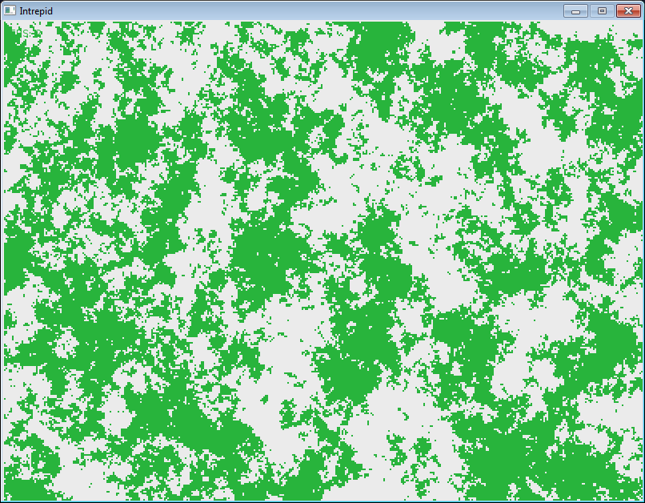

# Intrepid

> No one left has seen it, but those who were there in the beginning said it is in the heart of that mountain peak where winter was born and grew to snuff the warm from our world. Scholars traveled in caravans to study why, and how it might be stopped. Warriors embarked to challenge it with steel and magic.

> All failed. Those that could not stay warm now clutch their books and hilts forever. The rest were turned back. The wind protects it. Thick forests can secure you from the gale, but some other undying danger has been seen dancing in the shadow of the canopy.

> It has been many years since the Last Expedition left your home to march to Gotterdammerung, that tall cold peak. The fire of your peoples’ bravery is dimming against a wintry advance.

> You must find them.

